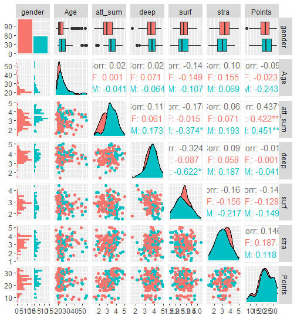
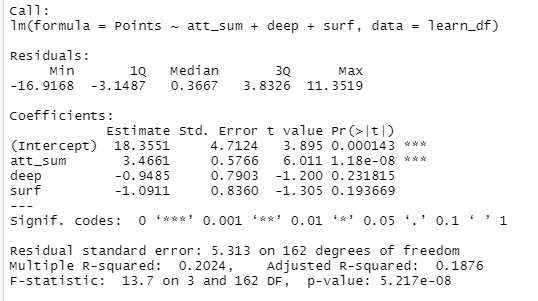
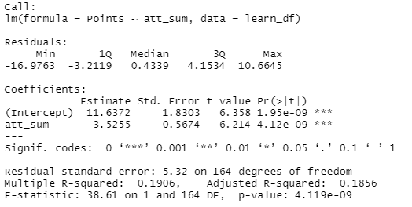
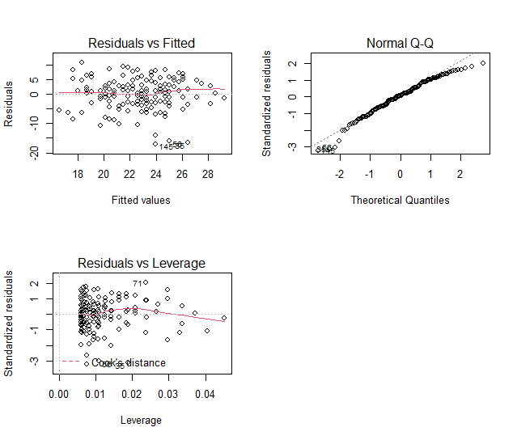

# Week 2 notes, regression

*Describe the work you have done this week and summarize your learning.*

- Describe your work and results clearly. 
- Assume the reader has an introductory course level understanding of writing and reading R code as well as statistical methods.
- Assume the reader has no previous knowledge of your data or the more advanced methods you are using.

```{r}
date()
```

## Description of the data
The data includes altogether 7 variables: gender, age, and exam points in addition to sum variables for attitude towards statistics, deep approach for learning, surface approach for learning and strategic approach for learning. There is altogether 166 observations. 

## Graphical overview of the data  

  

The sum variables (attitude, deep, surface, stra) are relatively normally distributed for a social sciences data. The age is quite skewed, there are much more younger than older students. Furthermore, there are more female students compared to males. The strongest correlation is between the exam points and attitude.  

## Regression model  

I tested a model where exam points were the dependent variable
and attitude, deep approach and surface approach where 
independent variable. Summary of findings is below.



As deep and surface approaches are not significantly associated with
exam points, I rerun the model without them. Summary of the new model
findings is below.  



## Interpretation of findings

While deep and surface approaches to learning were not significantly associated with exam points, student's attitude to statistic was. Multiple R-squared was 0.19, indicating that almost 20% of the variation in exam points can be explained by attitude to statistics. 

## Diagnostic plots



It seems that the constant variance assumption is ok, as there seems to be no apparent pattern in the scatterplot but residual points are random (Residuals vs. Fitted plot). It seems that the errors of the model are reasonably normally distributed, although there are some deviations both in the beginning and in the end (Normal Q-Q plot). It seems that there are no outliers that have considerable influence on the findings, as no single observation stands out in the plot (Residuals vs. Leverage plot).

