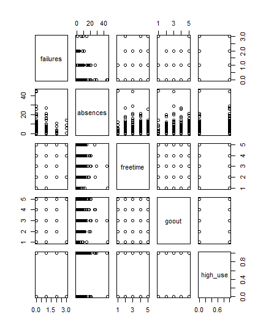

# Week 3 notes, logistic regression


```{r}
date()
```
##Preparations and data description

This is the chapter3.rmd file that shows on my diary page.
To make sure I have the correct dataset after issues in the  data wrangling, I read the file from IODS project.

The dataset includes information on students' achievement in secondary education in Mathmatics and Portuguese. Additionally, the data includes demographic information.

## My hypothesis

I assume that student failures, absences, going out with friends and free time after school predict high  alcohol consumption.

## Exploring distributions

Summary of my chosen variables is as follows. 

```{r}
#    failures         absences         freetime         goout      
# Min.   :0.0000   Min.   : 0.000   Min.   :1.000   Min.   :1.000  
# 1st Qu.:0.0000   1st Qu.: 1.000   1st Qu.:3.000   1st Qu.:2.000  
# Median :0.0000   Median : 3.000   Median :3.000   Median :3.000  
# Mean   :0.1892   Mean   : 4.511   Mean   :3.224   Mean   :3.116  
# 3rd Qu.:0.0000   3rd Qu.: 6.000   3rd Qu.:4.000   3rd Qu.:4.000  
# Max.   :3.0000   Max.   :45.000   Max.   :5.000   Max.   :5.000  
#
# high_use      
# Mode :logical  
# FALSE:259      
# TRUE :111    
```

Further, the graphical overview looks as follows:



It seems that the absences has the strongest association with high consumption of alcohol. In contrast, other variables seem not to have a significant association with high alcohol.

