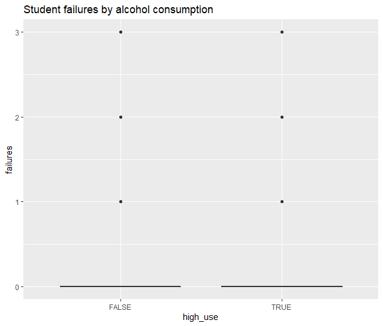
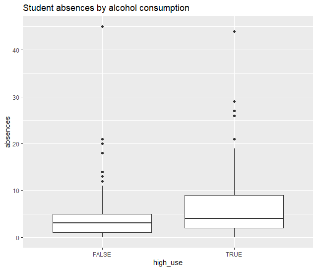
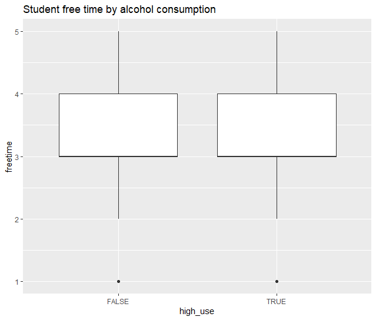
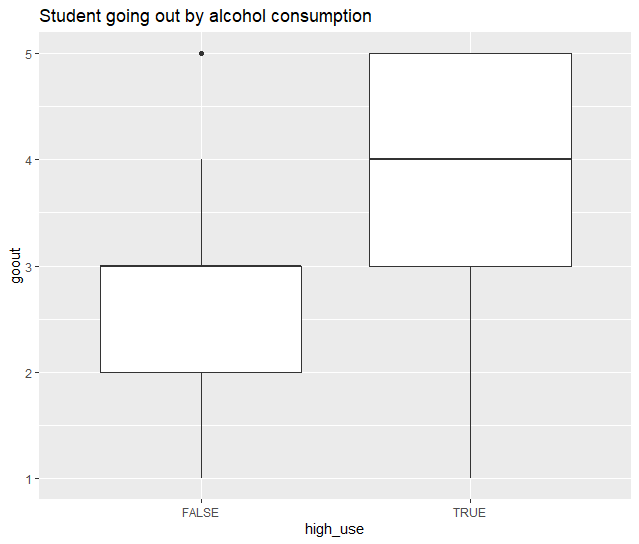

# Week 3 notes, logistic regression


```{r}
date()
```
##Preparations and data description

This is the chapter3.rmd file that shows on my diary page.
To make sure I have the correct dataset after issues in the  data wrangling, I read the file from IODS project.

The dataset includes information on students' achievement in secondary education in Mathmatics and Portuguese. Additionally, the data includes demographic information.

## My hypothesis

I assume that student failures, absences, going out with friends and free time after school predict high  alcohol consumption.

## Exploring distributions

Summary of my chosen variables is as follows. 

```{r}
#    failures         absences         freetime         goout      
# Min.   :0.0000   Min.   : 0.000   Min.   :1.000   Min.   :1.000  
# 1st Qu.:0.0000   1st Qu.: 1.000   1st Qu.:3.000   1st Qu.:2.000  
# Median :0.0000   Median : 3.000   Median :3.000   Median :3.000  
# Mean   :0.1892   Mean   : 4.511   Mean   :3.224   Mean   :3.116  
# 3rd Qu.:0.0000   3rd Qu.: 6.000   3rd Qu.:4.000   3rd Qu.:4.000  
# Max.   :3.0000   Max.   :45.000   Max.   :5.000   Max.   :5.000  
#
# high_use      
# Mode :logical  
# FALSE:259      
# TRUE :111    
```

Further, the graphical overview of the associations in box plots:








It seems that other going out and absences might have a signifincant association with high alcohol consumption. I fail to interpret the first plot on failures, it is probably difficult to see any differences in a box plot due to small scale of failures.

## Logistical regression

Summary of the first model as defined above is as follows:

```{r}
#  Call:
# glm(formula = high_use ~ failures + absences + freetime + goout, 
#    family = "binomial", data = alc2)
#
#Deviance Residuals: 
#    Min       1Q   Median       3Q      Max  
#-1.9919  -0.7563  -0.5470   0.8696   2.2914  
#
#Coefficients:
#            Estimate Std. Error z value Pr(>|z|)    
#(Intercept) -4.04295    0.55890  -7.234 4.70e-13 ***
# failures     0.53878    0.22148   2.433 0.014989 *  
# absences     0.07643    0.02238   3.416 0.000636 ***
# freetime     0.17123    0.13827   1.238 0.215562    
# goout        0.65511    0.12309   5.322 1.02e-07 ***
#---
#Signif. codes:  0 ‘***’ 0.001 ‘**’ 0.01 ‘*’ 0.05 ‘.’ 0.1 ‘ ’ 1
#
#(Dispersion parameter for binomial family taken to be 1)
#
#    Null deviance: 452.04  on 369  degrees of freedom
#Residual deviance: 382.52  on 365  degrees of freedom
#AIC: 392.52
#
#Number of Fisher Scoring iterations: 4 
```
It seems that absences and going out are the strongest predictors of high alcohol consumption (p<.001). Also, failures is a significant predictor (p=.015). In contrast, free time has no significant association with high alcohol consumption.

Odds ratios and confidence intervals are as follows:

```{r}
#                    OR       2.5 %    97.5 %
#(Intercept) 0.01754567 0.005618127 0.0505103
#failures    1.71392229 1.115709763 2.6722685
#absences    1.07942265 1.034346065 1.1305247
#freetime    1.18676339 0.905951522 1.5600976
#goout       1.92535794 1.521221605 2.4676481
```
All the odds are higher than 1, so the higher the value of the variable, the more likely person is to belong in high alcohol consumption group. However, for the free time variable the confidence interval overlaps 1 which explains why it was not significant predictor. Overall, going out is the strongest predictor of high alcohol consumption, as its odds-ratio is the highest.

## Predictive power

Cross-tabulation of predictions and actual values are as follows:
```{r}
#         prediction
#high_use FALSE TRUE
#   FALSE   237   22
#   TRUE     67   44
```
The calculated training error is 0.3 meaning that a third of the observations were falsely classified. This means that the model predicts high alcohol consumption better than guessing, since that would be 50-50.   

